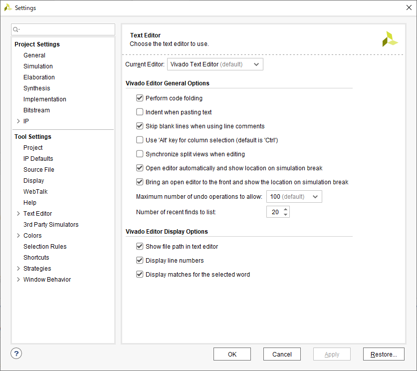

## エディタの変更方法
1. `Tools` => `Settings...`
2. 左側のペインにある `Tool Settings` => Text Editor
3. 右側のペインの `Current Editor` を好きなものに変える。

## 注意
- エディタがインストールされていないとエラーが発生します。エディタの用意は各自で。
- Vivadoで使用されている日本語の文字コードは `Shift-JIS` です。 `UTF-8` ではないので注意。
- シンタックスハイライトやエディタ中の波線警告などは、エディタに依存します。
`Vivado Text Editor (default)` はそのあたりを勝手に表示してくれるので、初心者にはおすすめです。