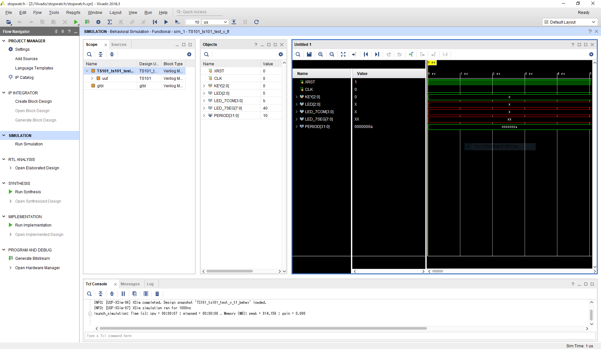
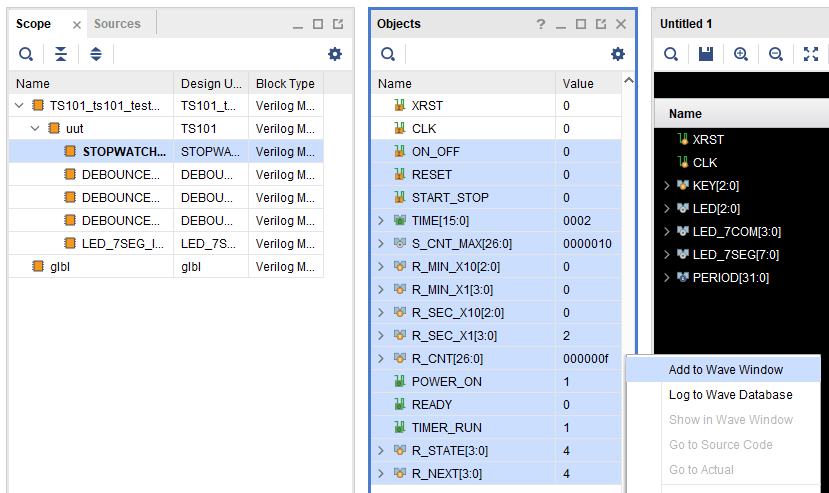
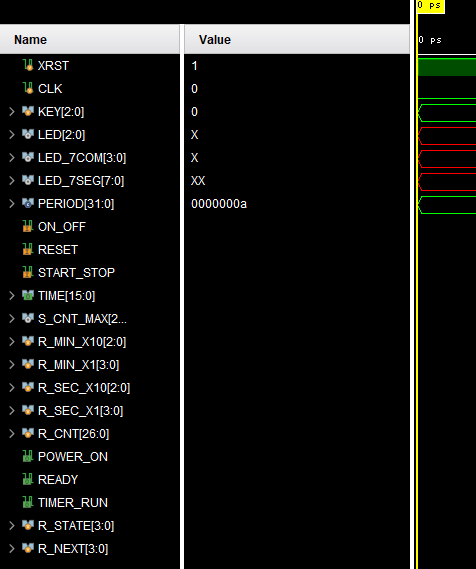
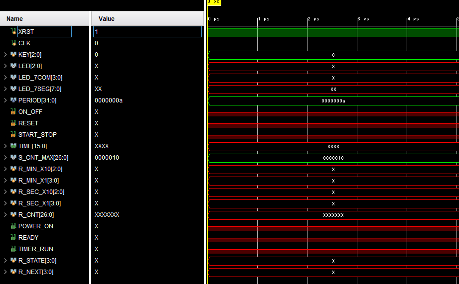

複雑な回路をシミュレーションする際、デフォルトで表示されるトップモジュールのinput, output以外に、各モジュールの内部信号をかんたんに調べることができます。

まず、シミュレーションまで進めます。

左のScopeから探したい信号があるモジュールを選択し、その右のObjectsから必要な信号を選択したら、
右クリックをして `Add to Wave Window` を実行します。

Wave Windowに信号が追加されました。

最後に、 を押してリロードを行うことで、追加した信号の波形が表示されます。

デバッグ時に有効活用しましょう。