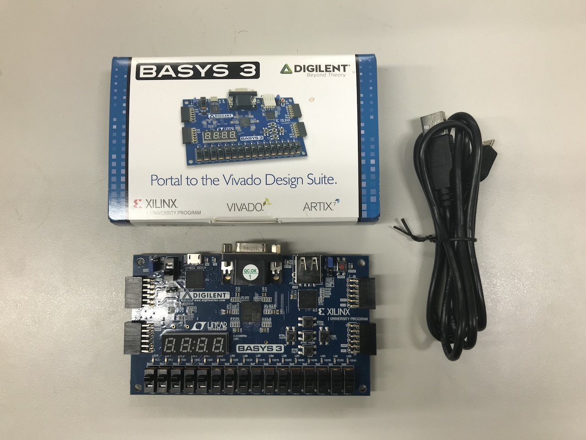
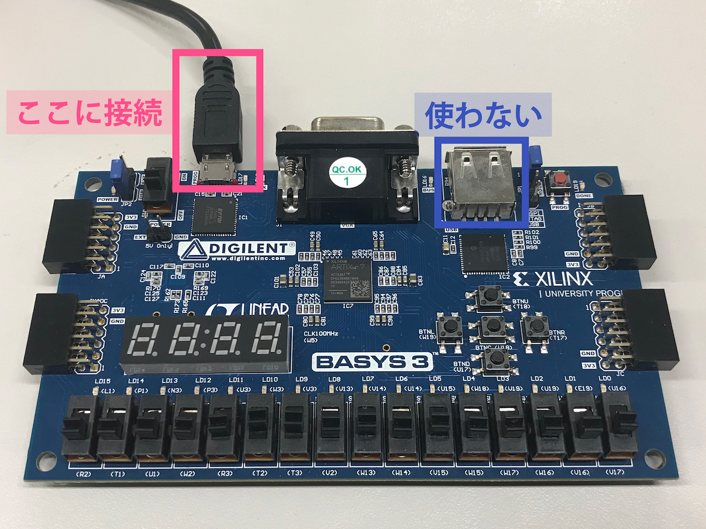
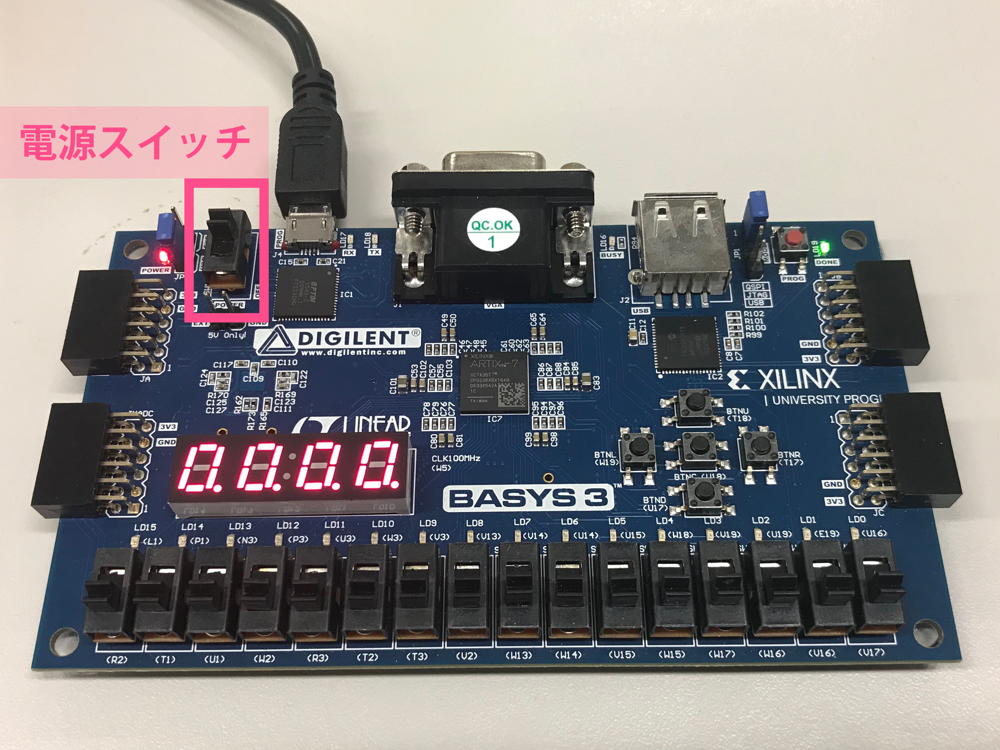
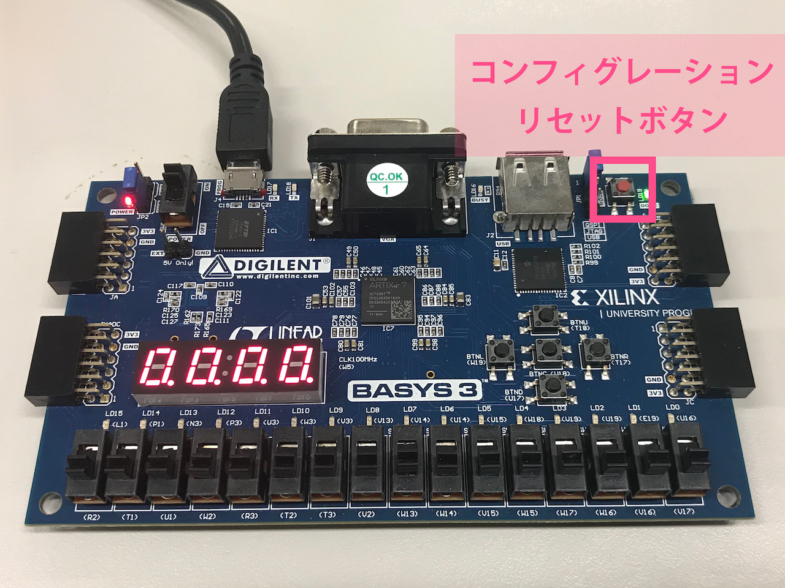

<strong>こちらではオフライン演習の場合のコンフィグレーション手順を示しています。リモート演習の場合は、<a href="/adv1a-fpga-tutorial/docs/conf-remote">こちら</a>へ進んでください。 </strong> 

いよいよ実機での動作を行っていきます。  
まず、以下のセットがあるかどうか確認しましょう。  
**実機は壊れないよう、また箱は破れないよう丁寧に扱うこと！！！！！**
- Basys3 本体
- 接続用 USBケーブル

## PCとの接続
次に、接続用USBケーブルを、`Basys3` に接続します。  
写真の位置に micro USB 端子があるので、こちらにケーブルをつなぎます。  
`Basys3` 上にある USB-A 端子は使用しないので注意しましょう。  
接続できたら、PCにケーブルを接続します。

## Basys3の電源
電源スイッチは以下の図のスライドスイッチです。上げると電源が入り、下げると電源が切れます。  
電源を投入するとデモ動作が始まり、7セグLEDに数字が表示されるなど、あらかじめ設定されている動作が行われます。

## コンフィグレーションのリセット
`Basys3` のコンフィグレーションリセットボタン(赤いボタン)を押すことにより、`Vivado` から転送したデータを削除し、デモ動作の状態に戻すことができます。

注意: 毎回の授業が終わるごとに、必ずこのボタンを押してデータを削除してください

