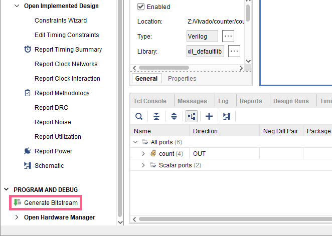
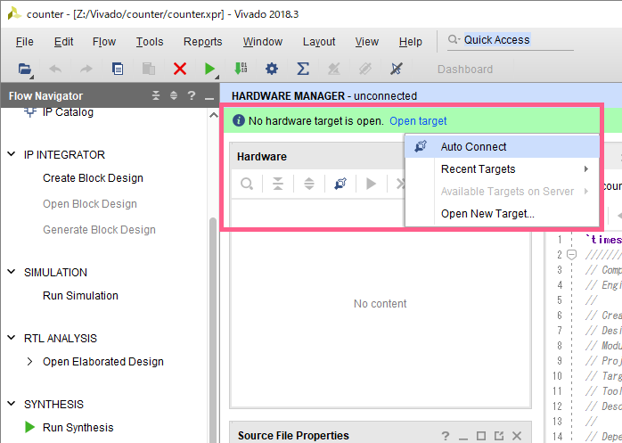

続いて、`Vivado` 上でコンフィグレーションを行い、FPGAにデータの転送を行います。
まず、`Basys3`をPCに接続し、電源を入れておきましょう。

## ビットストリームファイルの生成
`Flow Navigator` => `PROGRAM AND DEBUG` => `Generate Bitstream` をクリック

`OK` をクリック

生成が完了すると、以下の画面が表示される。
`Open Hardware Manager` を選択して、`OK` をクリック

## コンフィグレーションの実行
`Hardware Manager`を開くと、上部に緑色の帯が現れ、`Open target` が表示される  
`Open target` をクリックし、出てきたメニューから `Auto Connect` をクリック  
`Vivado` がPCに接続されたボードを自動的に検出し、接続まで行ってくれる

もし `Windows Defender` の画面が表示された場合、`アクセスを許可する` をクリック

無事接続できれば、以下の画面に変化する  
`Program Device` をクリック

`Bitstream file` のファイルパスは自動的に入力されている  
`Program` をクリックすれば、コンフィグレーションが行われる

これにて実機が動作を開始します。  
まずリセットボタン `BTNU` を一度押してから、仕様通りの動作をするか確認してみましょう。  
うまく動作しなかった場合は、画面下部の `Messages` タブのエラーメッセージをよく読みながら、デバッグを行いましょう。  
**動作を確認したら、コンフィグレーションリセットボタンを押すのを忘れずに！**

## `Hardware Manager`について
`Hardware Manager`が消えてしまった場合、`Open target` や `Program Device` は、画面下部の図の位置からも行える

