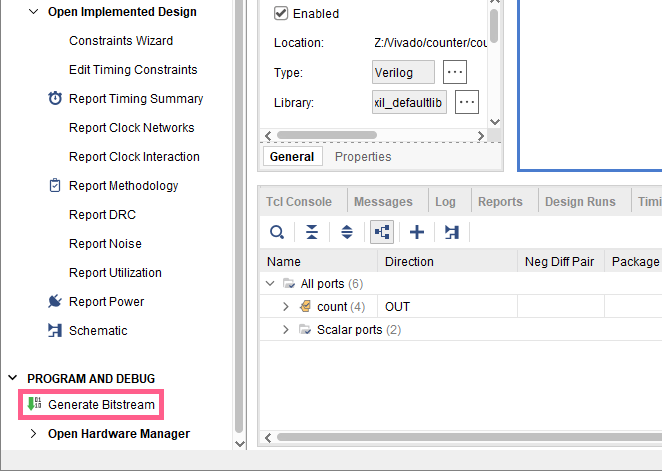
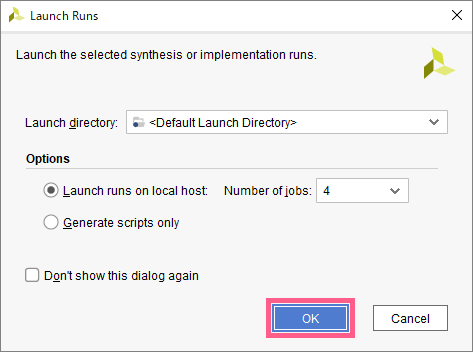
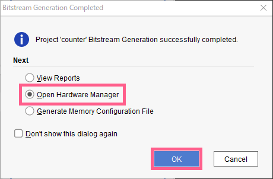
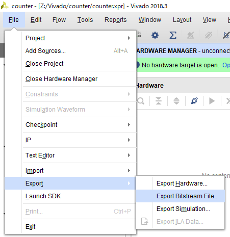
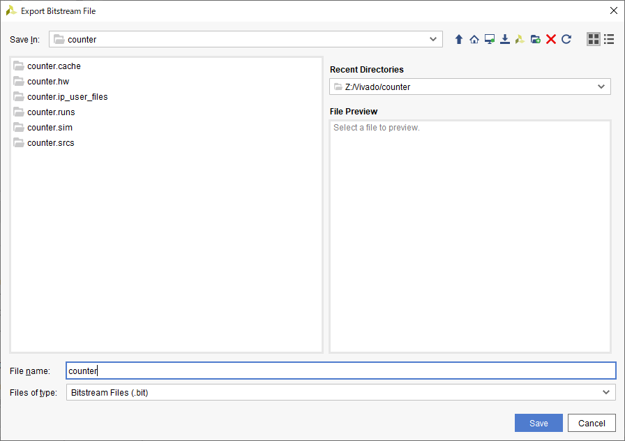
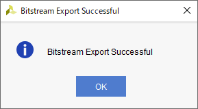
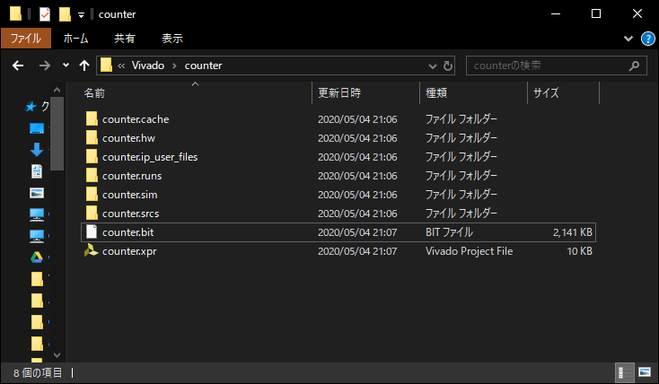

<strong>こちらではリモート演習の場合のコンフィグレーション手順を示しています。オフライン演習の場合は、<a href="/adv1a-fpga-tutorial/docs/conf-01">こちら</a>へ進んでください。 </strong> 

続いて、`Vivado` 上でコンフィグレーションを行い、FPGAに転送するためのデータを作成します。

## ビットストリームファイルの生成
`Flow Navigator` => `PROGRAM AND DEBUG` => `Generate Bitstream` をクリック

`OK` をクリック

生成が完了すると、以下の画面が表示される。
`Open Hardware Manager` を選択して、`OK` をクリック

## 設計データの保存
最後に、生成した設計データを保存しましょう。  
`File` => `Export` => `Export Bitstream File...`

`File name`に適当なファイル名を入力し、`Save`  
この時、保存したフォルダを覚えておくこと。  
デフォルトではVivadoフォルダの各プロジェクトの直下に保存される。  
(画像では `Z:/Vivado/counter`)

以下の画面が表示されたら、保存完了。OKを押す。

エクスプローラーで先程のフォルダを探すと、`.bit` というファイルがある。  
これが設計データ(Bitstream File)なので、このファイルを送信すればOKです。
