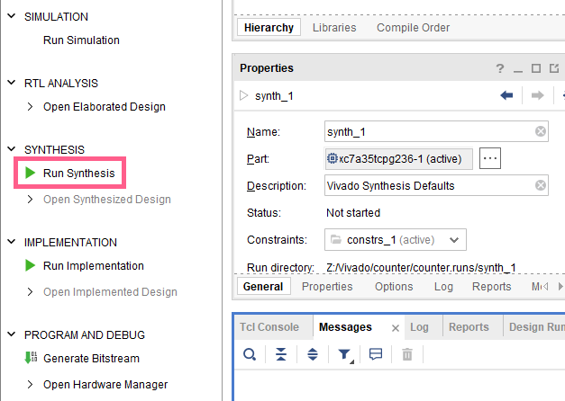
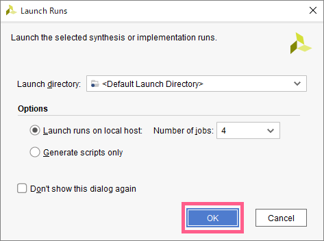
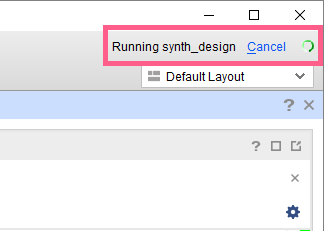
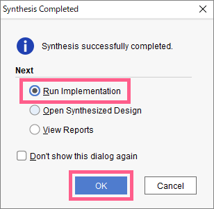
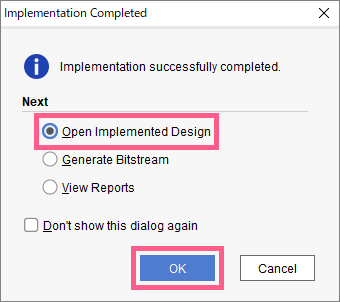
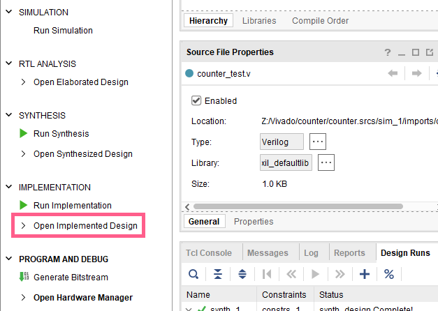
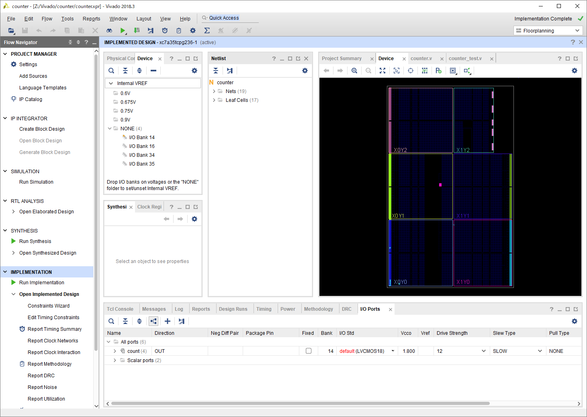

## 論理合成の実行
`Flow Navigator` => `SYNTHESIS` => `Run Synthesis` をクリック

`OK` をクリック

自動的に論理合成が行われる。ステータスは右上に表示される。  
設計によっては長時間かかるため、気長に待つこと。

## レイアウトの実行
論理合成にエラーがなければ、以下の画面が表示される。  
`Run Implementation` が選択されていることを確認し、`OK` を押すと、そのままレイアウトが行える。  
(`Implementation` = 配置配線、つまりレイアウトのこと)

または、`Flow Navigator` => `IMPLEMENTATION` => `Run Implementation` をクリック

## レイアウトデザインを開く
レイアウトにエラーがなければ、以下の画面が表示される。  
`Open Inplemented Design`が選択されていることを確認し、`OK`

または、`Flow Navigator` => `IMPLEMENTATION`  => `Open Implemented Design` をクリック

以下の画面が表示されればレイアウト完了

ただし、レイアウトを終えただけでは、まだ実機に実装することはできません。  
実機に実装するためには、
- クロックの設定
- LED、ボタン、スイッチなどの割り当て (ピンアサイン)

が必要となります。まず、クロックの設定を行いましょう。
