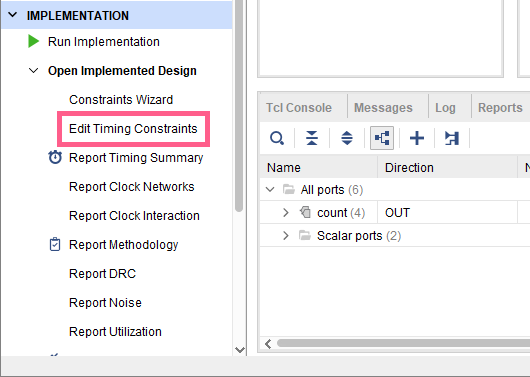
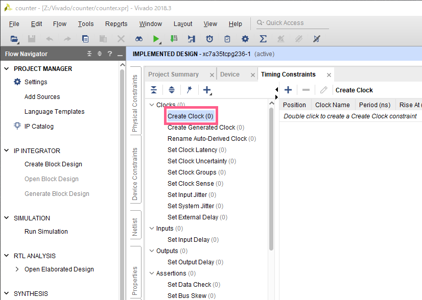
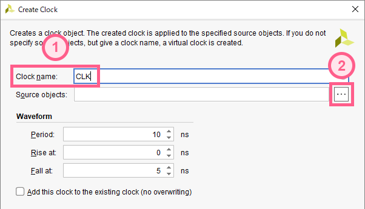
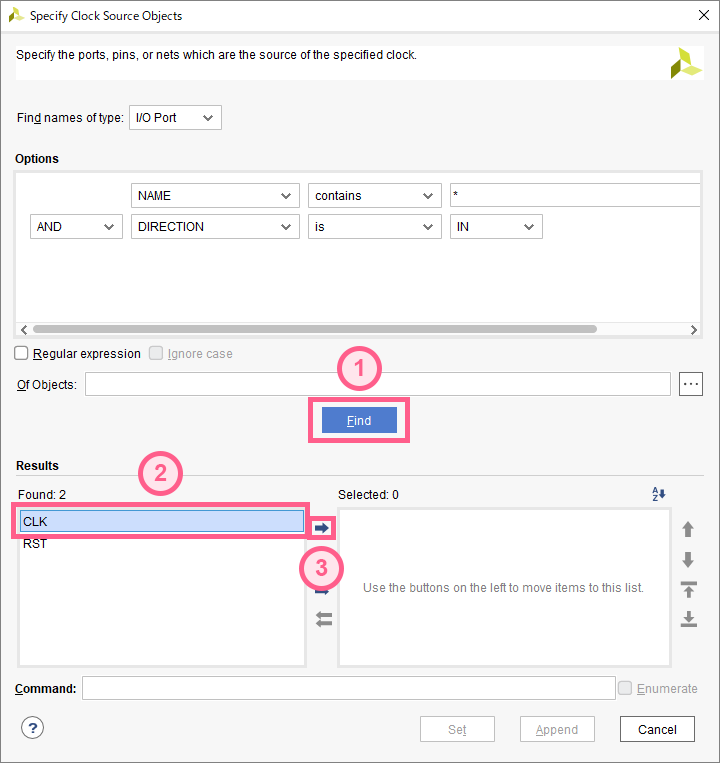
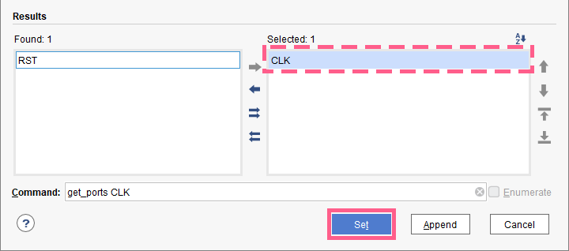
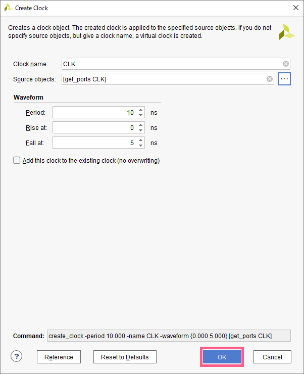
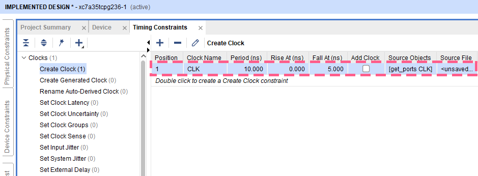

順序回路にはクロックが必要ですが、`Vivado`でレイアウトをする際には、クロックについて特別な設定が必要です。
以下の手順でクロックに関する設定を行っていきましょう。

## 1. タイミング制約編集画面を開く
`Flow Navigator` => `IMPLEMENTATION` => `Open Implemented Design` => `Edit Timing Constraints` を開く

## 2. 新規クロックの作成
`Timing Constraints` タブが開くので、`Clocks` 内の `Create Clock` をダブルクリック

## 3. クロックネームの入力
1. `Clock name` の部分に、自分の設計したソースファイルのクロックの名前を入力する  
(図の例では `CLK`)
2. `Source objects` の右側の `...` ボタンをクリック

## 4. クロックの指定
1. 中央付近にある `Find` ボタンをクリック
2. `Results` の左側 (`Found`) から、自分の設計したソースにおけるクロック(`CLK`)を選択
3. `→`ボタンをクリック

以下の図のように、クロックが `Found` から `Selected` に移動していればOK  
`Set`ボタンをクリック

## 5. 完了
以下の図のようになっていることを確認し、`OK`をクリック  
(この画面の中央を見ると、`Waveform` の `Period` が 10ns なので、クロック周波数は 100MHz であることが分かる)

図の点線部の位置に、今作成したクロックが表示されていればOK

