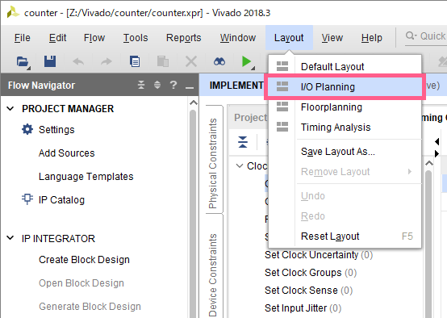
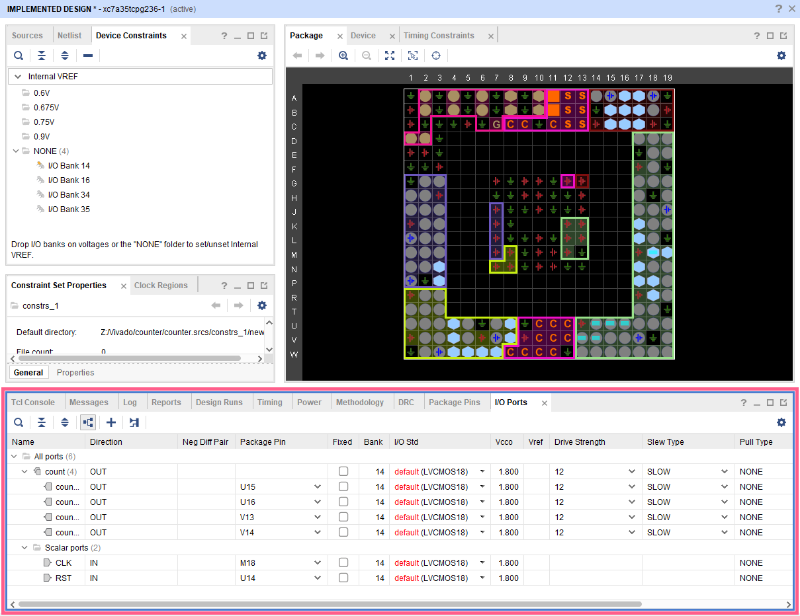
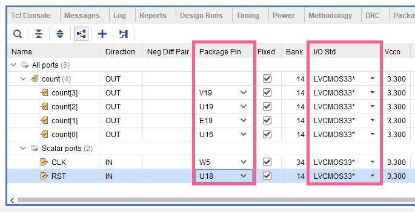

FPGAとボタン・スイッチ・LEDなどのパーツは、ボードを介して接続されています。一方、RTL設計で記述したソースファイル(モジュール)における入出力が、どのパーツを使用するかはまだ割り当てられていません(つまり、現在のままではLEDもボタンも動作しません)。また、クロックやリセットなども割り当てられていません。  
ここでは、RTL記述とハードウェアを結びつける作業(ピンアサインと言います)を行います。

## 設定画面の開き方
上側のメニューから、`Layout` => `I/O Planning` をクリック

下側の `I/O Ports` タブが開かれていることを確認する

## 編集箇所
この画面で変えなければいけない箇所は、以下の2箇所である。
- `Package Pin`: 設計した回路と、ボード上の入出力装置の関係を指定する
- `I/O Std`: 供給する電圧の値を指定する

## `Package Pin`
まず、`Package Pin` は、以下の`Basys3`のパーツの配置図とピンの対応表を見て適切なポートを選択する。  
(7セグLED以外は、ボード上にもピンが記載されているので、そちらを見ても良い)

### `Scalar Ports`
|Name|Package Pin|
|:-:|:-:|
|クロック|W5|
|リセット(ボタン上)|T18|

### ボタン
押すと`1` , 放すと`0`
|Name|Package Pin|
|:-:|:-:|
|BTNU(上、リセット用)|T18|
|BTND(下)|U17|
|BTNL(左)|W19|
|BTNR(右)|T17|
|BTNC(中央)|U18|

### LED・スイッチ
|種類|記号|`1`のとき|`0`のとき|
|:-:|:-:|:-:|:-:|
|LED|`LD`|点灯|消灯|
|スイッチ|`SW`|上|下|

ボード上の配置は、左から順に `15` , `14` , ... , `0`

|Name|Package Pin|Name|Package Pin|
|:-:|:-:|:-:|:-:|
|LD15|L1|SW15|R2|
|LD14|P1|SW14|T1|
|LD13|N3|SW13|U1|
|LD12|P3|SW12|W2|
|LD11|U3|SW11|R3|
|LD10|W3|SW10|T2|
|LD9|V3|SW9|T3|
|LD8|V13|SW8|V2|
|LD7|V14|SW7|W13|
|LD6|U14|SW6|W14|
|LD5|U15|SW5|V15|
|LD4|W18|SW4|W15|
|LD3|V19|SW3|W17|
|LD2|U19|SW2|W16|
|LD1|E19|SW1|V16|
|LD0|U16|SW0|V17|

### 7セグLED
#### LED
`0` で点灯、 `1` で消灯  
(このチュートリアルのPDF版は、点灯消灯が間違っているので注意！)
|Name|Package Pin|
|:-:|:-:|
|A|W7|
|B|W6|
|C|U8|
|D|V8|
|E|U5|
|F|V5|
|G|U7|
|DP|V7|

#### セレクタ
左から順に `7SEG[3]`, `7SEG[2]`, `7SEG[1]`, `7SEG[0]`
|Name|Package Pin|
|:-:|:-:|
|7SEG[3]|W4|
|7SEG[2]|V4|
|7SEG[1]|U4|
|7SEG[0]|U2|

## `I/O Std`
`Basys3` では、入出力の電圧は3.3Vとなっている。  
そのため、全て `LVCMOS33*`を設定すれば良い。

## 参考ページ
[Basys 3 Reference Manual [Reference.Digilent.inc]](https://reference.digilentinc.com/reference/programmable-logic/basys-3/reference-manual)