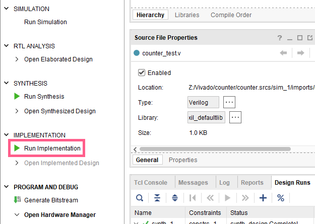
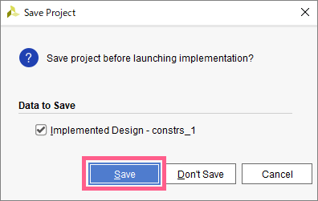
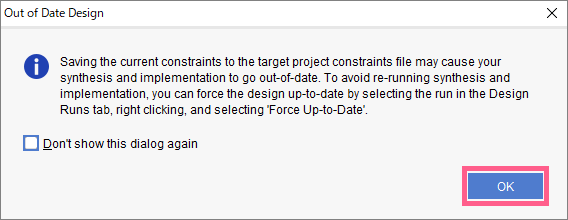
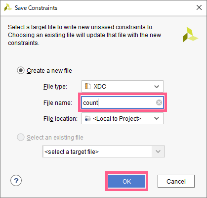
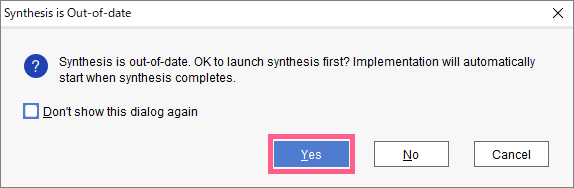
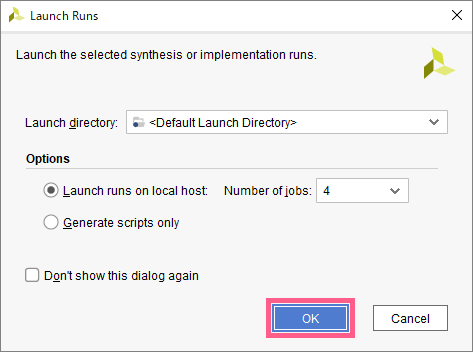
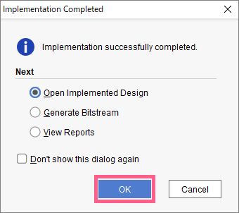

クロックの設定とピンアサインが完了したら、もう一度レイアウトを行うことで、設定情報を反映させます。

`Flow Navigator` => `IMPLEMENTATION` => `Run Implementation` をクリック

この画面が出たら、`Save` をクリック

この画面が出たら、`OK`をクリック

この画面が出たら、`File name`に ソースファイルと同じ名前を入力し、`OK` をクリック

この画面が出たら、`Yes`をクリック

`OK` をクリック

エラーがなければ、この画面が表示されるので、OKを押して完了
