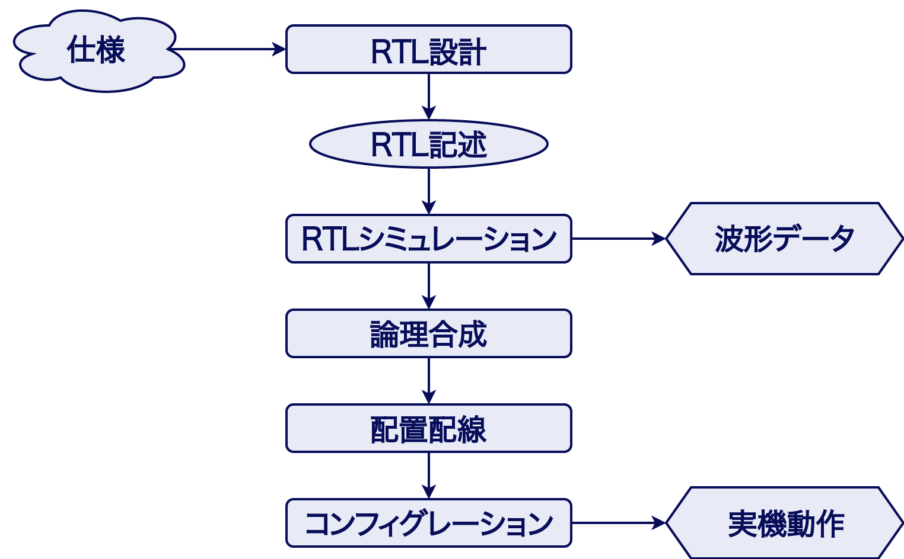

## 開発手順
FPGAで回路を作るには、以下の手順を踏みます。  

まず仕様を確認し、設計を考えます。
その後は、以下の手順に沿って開発を進めます。

開発手順 | 説明
--|--
RTL設計 | 仕様を確認し、どのようなハードウェアにするか設計を考えます。
RTL記述 | 設計を元に、ソースファイル(Verilogで記述された回路記述)を作成します。
RTLシミュレーション (Simulation) | RTL設計で作成した回路記述によって仕様通りの結果が得られるか、PC上でシミュレーションをします。
論理合成 (Synthesys) | RTLを元に、論理回路・ネットリストを生成します。
配置配線 (Implementation) | 論理回路を元に、実際のFPGA上への配置・配線方法を決定します。この時に、FPGAチップ外部のスイッチやボタン・LEDに対する配線も決めます。レイアウトとも言います。
コンフィグレーション (プログラム) | 配置配線データを元にFPGAを変更する「コンフィグレーションデータ」を生成し、FPGAに転送することで、実際の回路をFPGA上に構築します。

 

また、シミュレーションによって波形データが出力でき、コンフィグレーションを行うことでFPGAの実機動作が行えます。これらを用いてデバックを行い、仕様通りの回路を設計していくことになります。

この教材では、以下「RTLシミュレーション」のことを、略して「シミュレーション」と表記します。  
また、「配置配線」に関しては、「レイアウト」と表記します。

## 開発ツール [Vivado]
RTL記述からコンフィグレーションまでを行う統合開発環境には、Xilinx(ザイリンクス)社の、`Vivado(ビバード) 2018.3` を使用します。このツールを使うことで、RTL記述からコンフィグレーションまでまで、すべての手順を簡単に行うことができます。

## 実機 [Basys3]
実機には Digilent(デジレント)社の `Basys3(ベイシススリー)` を使います。このBasys3は、Xilinx社のFPGAである `Artix-7` を中心に、LEDやスイッチ、USBポートなどをまとめた機材で、評価ボードと呼ばれるボードの一種です。

続いて、`Vivado`の開き方を解説します。