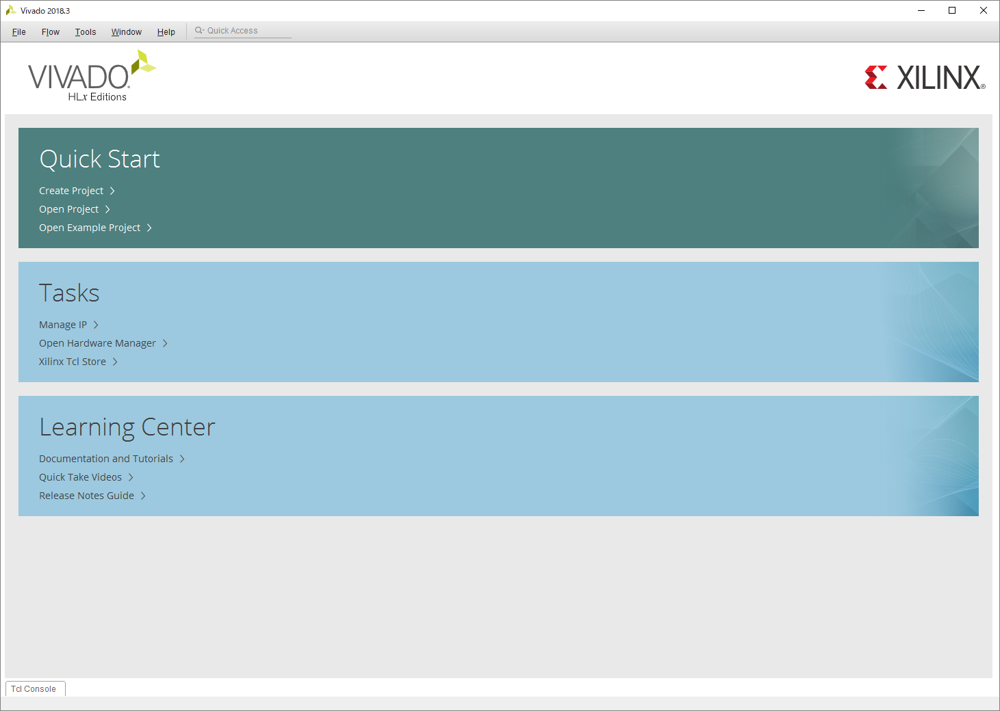

**画面は `Vivado 2018.3` で説明していますが、特段操作に変更はありません。**
**もし不明点があったら、TAに聞いてください。**

以下の手順より、`Vivado`を開くことができます。

``` bash
スタートボタン =>
Xilinx Design Tools =>
Vivado 2019.2
```

**`Vivado HLS 2019.2` ではないので注意してください！**
適宜デスクトップなどにショートカットを作成しておくとよいでしょう。

起動すると以下の画面が表示されます。



