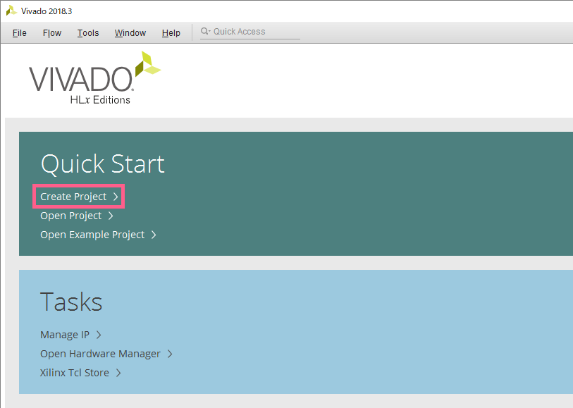
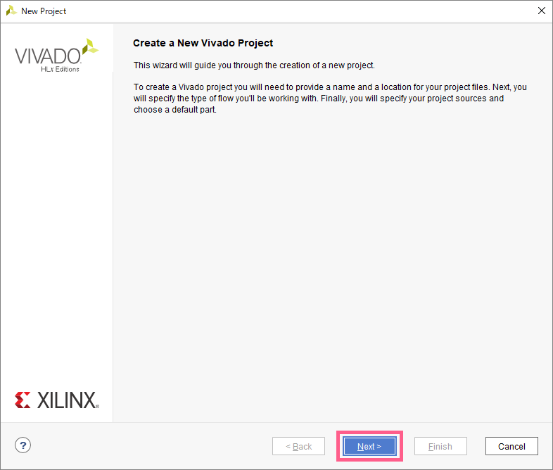
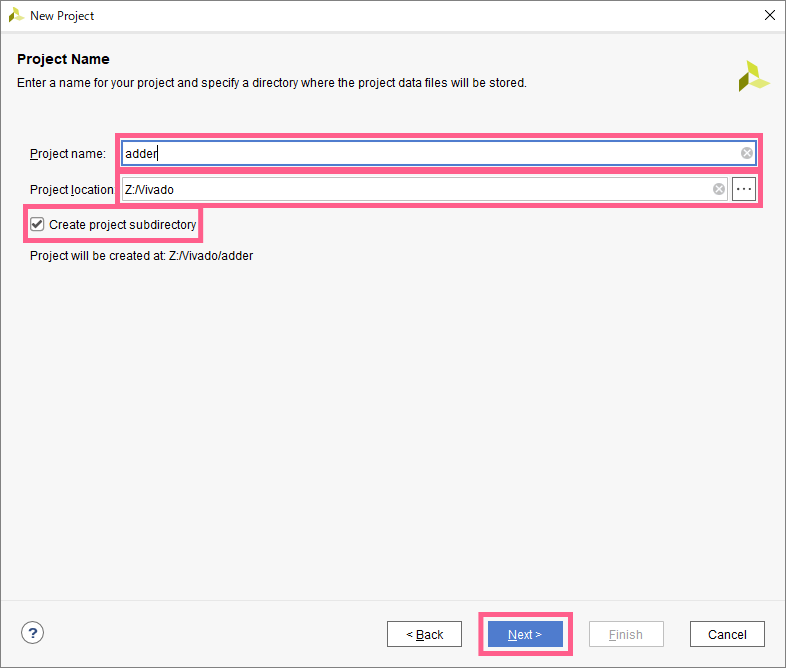
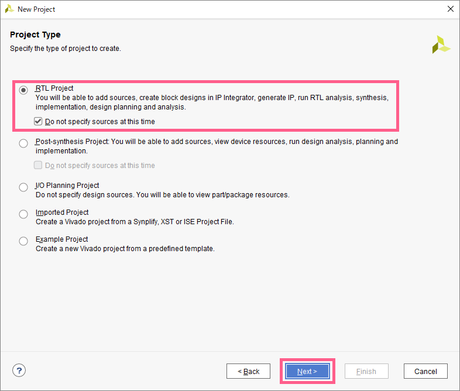
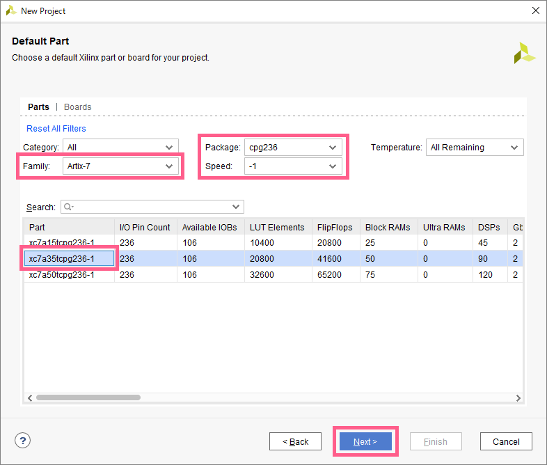
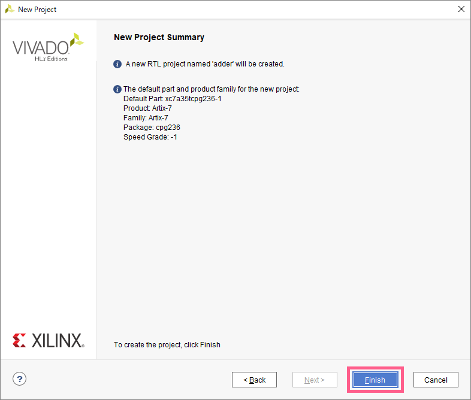
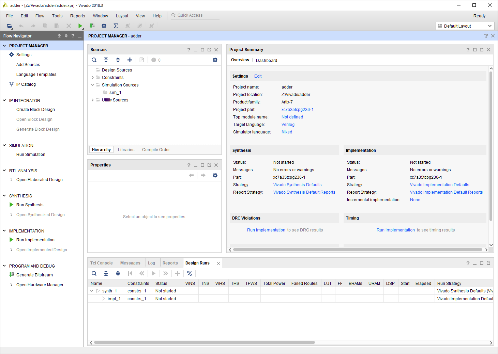
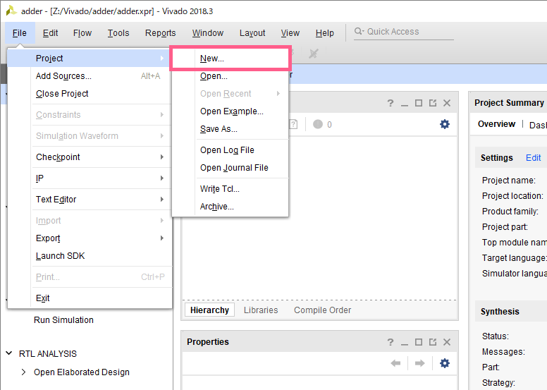

## 起動画面からのプロジェクト作成
`Vivado`を起動した状態から、新しいプロジェクトを作成します。  
プロジェクトは、設計単位ごとに新しい物を作成した方が良いです。  
課題ごとに新しいプロジェクトを作成するように意識しましょう。

### 1. `Quick Start => Create Project` をクリック

### 2. `Next` をクリック

### 3. プロジェクト名の設定

- `Project name` は先頭にアルファベットが来るような名前にすること
- `Project Location` は、ローカルディスクではなくMyVolumeを指定すること  
さらに、MyVolume上に `Vivado` というディレクトリを作成すること  
以下の図ではMyVolumeが `Z` なので、 `Z:/Vivado` を指定している
- `Create project subdirectory` にチェックを入れる
- 入力が終わったら、`Next` をクリック

### 4. プロジェクトタイプの設定

- `RTL Project` をチェック
- `Do not specify sources at this time` をチェック
- `Next` をクリック

### 5. FPGAのデータ入力

まずフィルターをかける
- `Package` を `cpg236` にセット
- `Family` を `Artix-7` にセット
- `Speed` を `-1` にセット

フィルターに従ってリストが更新されるので、`xc7a35tcpg236-1` を選択して、`Next` をクリック

### 6. プロジェクトのサマリーを確認

サマリーを確認して、`Finish` をクリック

### 7. 作成完了

以下の画面が出てくればOK

## メイン画面からのプロジェクト作成

`File => Project => New...` をクリックすると、[2. Next をクリック](#2-next-をクリック) から同様の手順でプロジェクトが作成できます。

