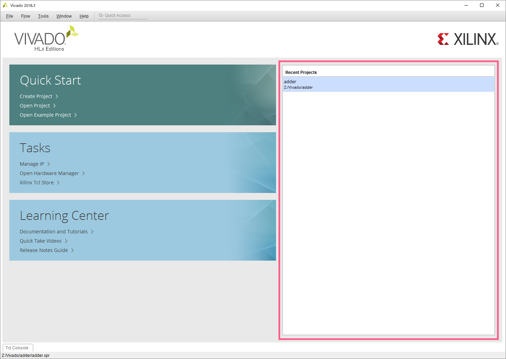
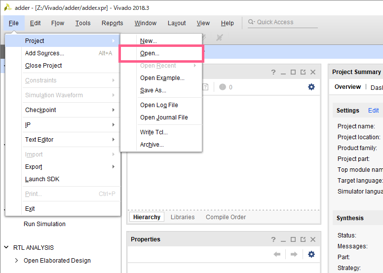
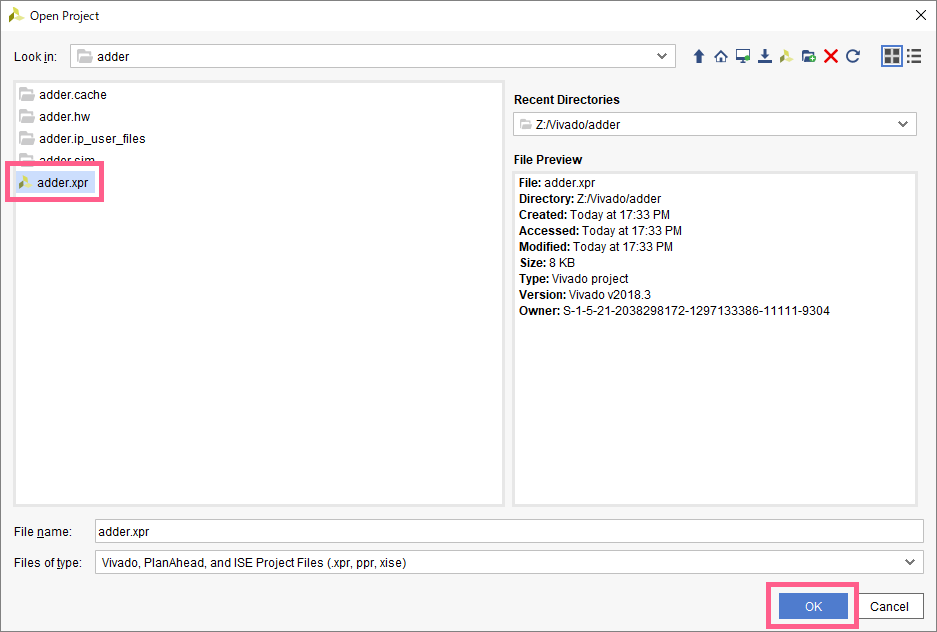

2回目以降の授業などで、前回の続きから再開したいときなどに使用します。

## `Quick Start` からプロジェクトを開く

今まで作成したプロジェクトが右側にリスト表示されるので、ここから開くと良い

## メニューからプロジェクトを開く

### 1. `File => Project => Open...` をクリックする

### 2. `xpr`ファイルを選択する

ディレクトリを移動し、拡張子が `xpr` のファイルを選択して、`OK` をクリック

