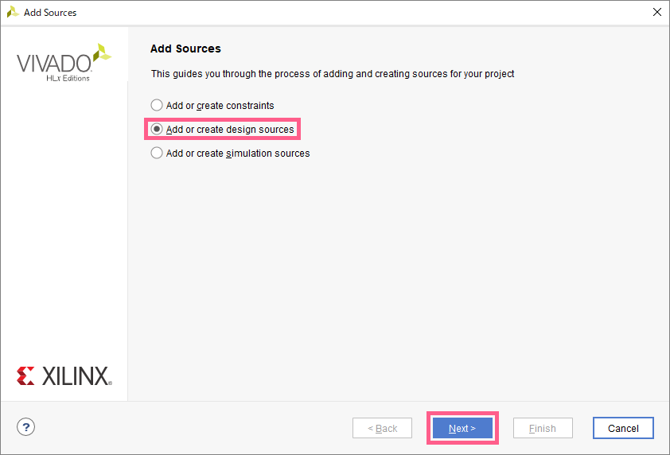
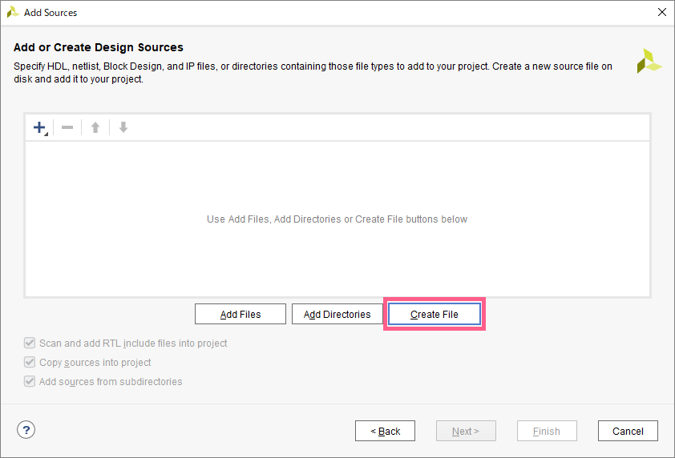
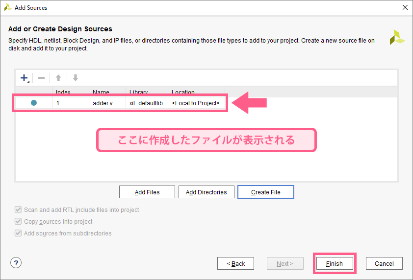
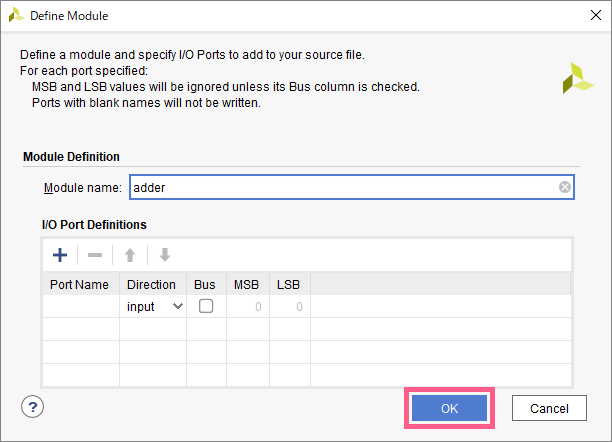
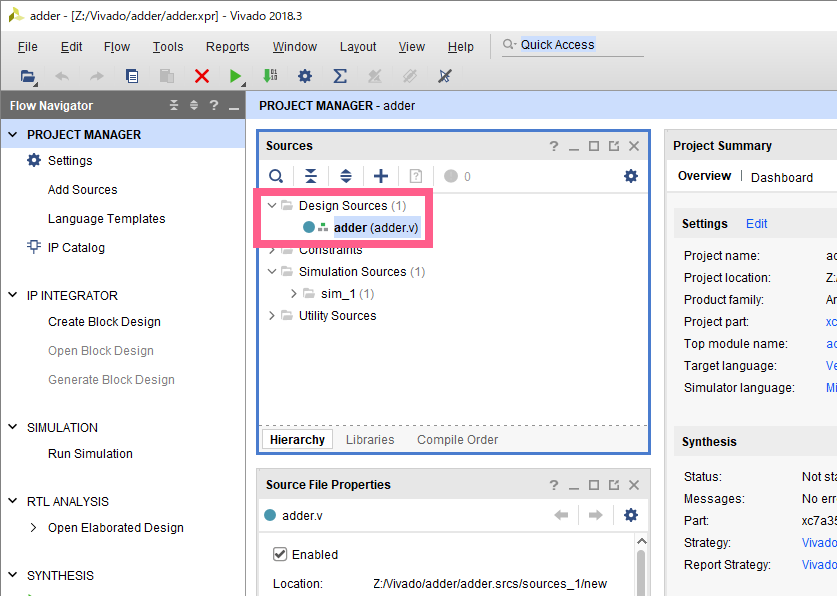
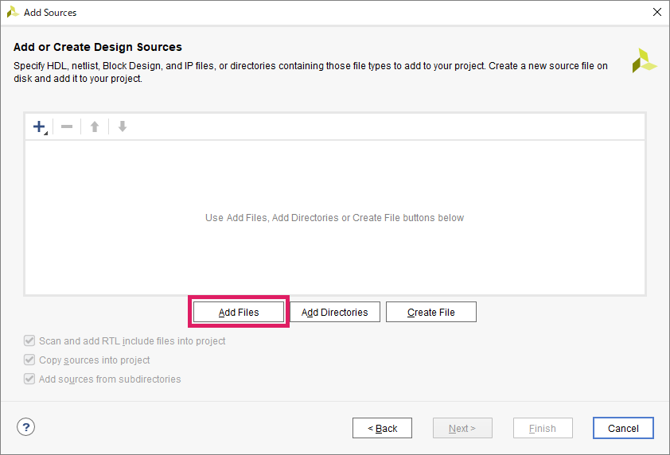

## ソースファイルの作成
例として、`adder` というVerilogファイルをプロジェクト上に作成する

### 1. Add Source の開始
`Flow Navigator` => `PROJECT MANAGER` => `Add Source` をクリック

### 2. 追加するソースファイルの種類の選択
RTL設計の場合、`Add or create design sources` を選択し、`Next` をクリック

### 3. ソースファイルの作成
`Create File` をクリック

### 4. ファイル名の入力
- `File type` は `Verilog` を指定
- `File name` にソースファイル名を入力 (日本語不可)、ここでは `adder`
- `File location` は `<Local to Project>` を指定

以上の設定を済ませたら、`OK` をクリック

### 5. ソースファイルの確認
4で入力したファイル名のVerilogファイルが作成されていることを確認  
必要に応じて、3 ~ 4 の操作を繰り返し、必要な数だけソースファイルを作成する  
確認ができたら、`Finish` をクリック

### 6. モジュール設定
モジュールの設定画面が出るが、ここではスキップする  
何もせずに `OK` をクリック

確認が入るので、`Yes` をクリック

### 7. 完了
`Project Manager` の `Sources` ペイン内の `Design Souces` ディレクトリ内に、  
先ほど指定した名前のVerilogファイル `adder` が作成されていればOK  

## ソースファイルの追加

基本的には作成と同様。  
手順 3 のみ、`Add Files` を選択し、出てきたウィンドウで追加したいソースファイルを指定する。

