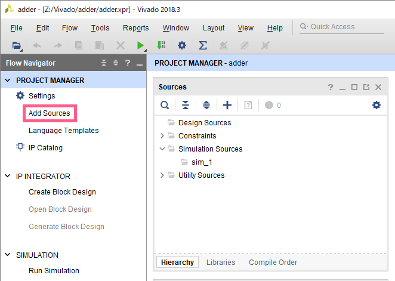
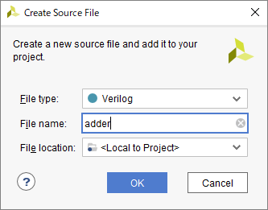
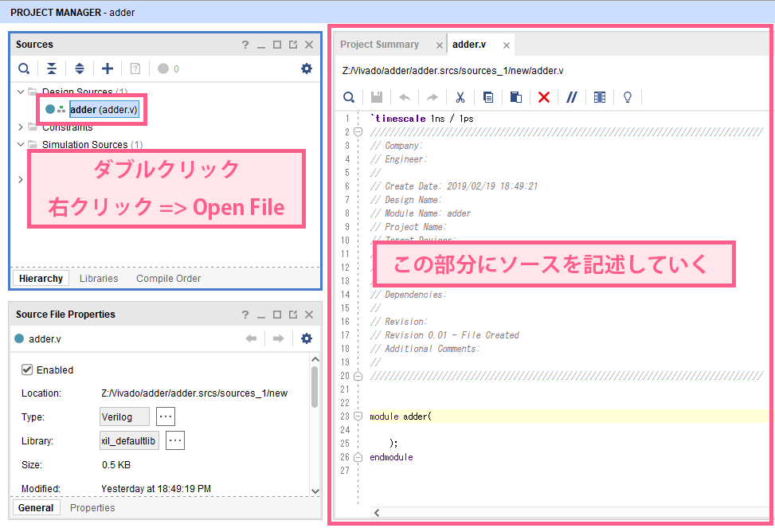
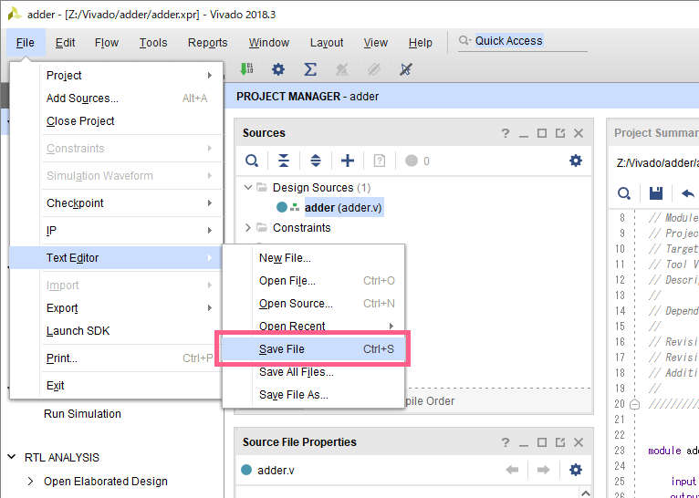
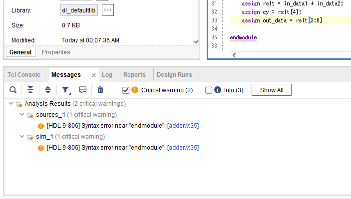

## プロジェクトにRTL用ソースファイルを追加
例として、`adder` というVerilogファイルを作成する

### 1. ソースを追加
`Flow Navigator` => `PROJECT MANAGER` => `Add Source` をクリック

### 2. 追加するソースファイルの種類の選択
RTL設計の場合、`Add or create design sources` を選択し、`Next` をクリック

### 3. ソースファイルの作成
`Create File` をクリック

### 4. ファイル名の入力
- `File type` は `Verilog` を指定
- `File name` にソースファイル名を入力 (日本語不可)、ここでは `adder`
- `File location` は `<Local to Project>` を指定

以上の設定を済ませたら、`OK` をクリック

### 5. ソースファイルの確認
4で入力したファイル名のVerilogファイルが作成されていることを確認  
必要に応じて、3 ~ 4 の操作を繰り返し、必要な数だけソースファイルを作成する  
確認ができたら、`Finish` をクリック

### 6. モジュール設定
モジュールの設定画面が出るが、ここではスキップする  
何もせずに `OK` をクリック

確認が入るので、`Yes` をクリック

### 7. 完了
`Project Manager` の `Sources` ペイン内の `Design Souces` ディレクトリ内に、  
先ほど指定した名前のVerilogファイル `adder` が作成されていればOK  

## RTL記述のコーディング
`Design Sources` 内のVerilogファイルをダブルクリックするか、  
右クリックメニューから `Open File` を選択すると、右側のペインがエディタになる  
このエディタを利用して、RTL記述を書いていく

### ソースファイルの保存
ソースファイルを保存するには、以下のどちらかを利用する
- キーボードショートカット: `Ctrl + S`
- メニューバー: `File` => `Text Editor` => `Save File`

### デバッグ
`Vivado` は、ソースファイルを保存するたびに、自動的にソースの構文チェックを行う  
もし、下部の `Messages` パネルに `Error` もしくは `Critical warning` がある場合、  
エラーを修正しないと、これ以降の作業ができないため、必ず修正すること  

(例として、33行目の行末のセミコロンを抜いた時のエラーを紹介する)
