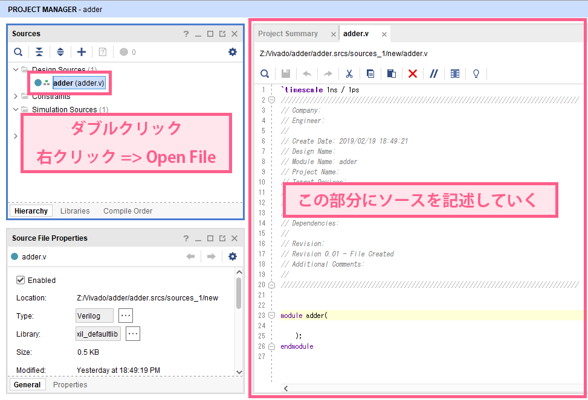
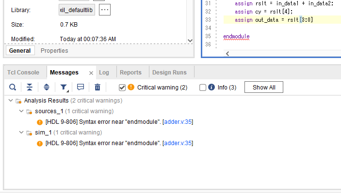

## RTL記述のコーディング
`Design Sources` 内のVerilogファイルをダブルクリックするか、  
右クリックメニューから `Open File` を選択すると、右側のペインがエディタになる  
このエディタを利用して、RTL記述を書いていく

### ソースファイルの保存
ソースファイルを保存するには、以下のどちらかを利用する
- キーボードショートカット: `Ctrl + S`
- メニューバー: `File` => `Text Editor` => `Save File`

### デバッグ
`Vivado` は、ソースファイルを保存するたびに、自動的にソースの構文チェックを行う  
もし、下部の `Messages` パネルに `Error` もしくは `Critical warning` がある場合、  
エラーを修正しないと、これ以降の作業ができないため、必ず修正すること  

(例として、33行目の行末のセミコロンを抜いた時のエラーを紹介する)
