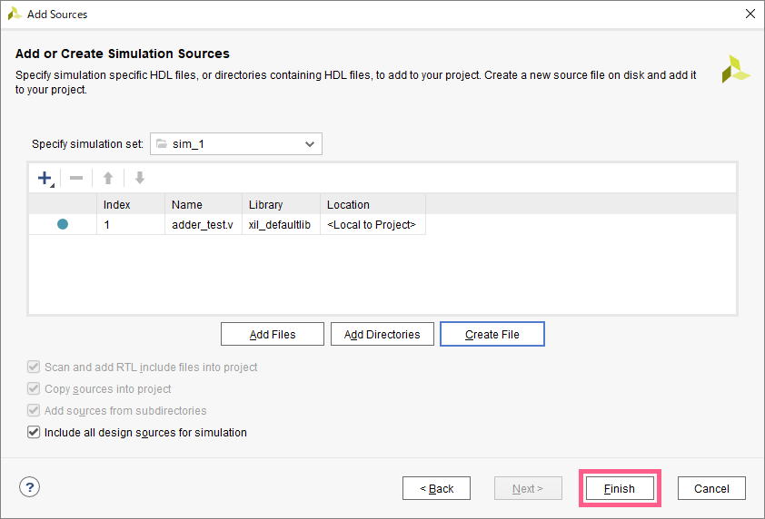

シミュレーションを行うためには、RTL記述で作成した回路に入力する信号や、波形として観測したい出力信号を定義した、「テストフィクスチャ(テストベンチ)」を作成する必要があります。  
ここでは、テストフィクスチャの作成の仕方を解説します。

## テスト用ソースファイルの作成

### 1. ソースを追加
`Flow Navigator` => `PROJECT MANAGER` => `Add Source` をクリック


### 2. 追加するソースファイルの種類の選択
テストフィクスチャの場合、`Add or create simulation sources` を選択し、`Next`


### 3. テスト用ソースファイルの作成
`Create File` をクリック


### 4. ファイル名の入力
- `File type` は `Verilog` を指定
- `File name` にソースファイル名を入力 (日本語不可)、ここでは `adder_test`  
**`test`などをつけることで、必ずRTL用ソースファイルと異なる名前を設定すること**
- `File location` は `<Local to Project>` を指定

以上の設定を済ませたら、`OK` をクリック


### 5. ソースファイルの確認
4で入力したファイル名のVerilogファイルが作成されていることを確認  
確認ができたら、`Finish` をクリック




### 6. モジュール設定
モジュールの設定画面が出るが、ここではスキップする  
何もせずに `OK` をクリック


確認が入るので、`Yes` をクリック


### 7. 完了
`Project Manager` の `Sources` ペイン内の `Simlation Sources/sim_1` ディレクトリ内に、先ほど指定した名前のVerilogファイル `adder_test` が作成されていればOK  


## テストフィクスチャの記述
`Simlation Sources` 内のVerilogファイルをダブルクリックするか、  
右クリックメニューから `Open File` を選択すると、右側のペインがエディタになる  
このエディタを利用して、授業資料を参照しながら、テストフィクスチャを完成させる


### サンプル


### 記述のヒント
- **入力は `reg`、出力は `wire`** で定義する
- 確認したい回路とテストフィクスチャの接続は、以下のように記述する  
    ```Verilog
    RTLモジュール名 uut (
        .入力ポート名(入力ポート名),
        .出力ポート名(出力ポート名)
    )
    ```
- `initial` 文や、 `always` 文のブロックの中に、**入力信号の変化**と**信号が変化するタイミング**を記述する。よく使う記号は以下の通り。
    ```Verilog
    #10      // 10単位時間だけ待つ。timescale 1ns/1ps の時は、単位時間は1ns
    $finish  // 波形の生成を止める
    ```
- `initial` 文は主に入力信号の切り替えに、`always` 文は主にクロックの生成に利用すると良い

