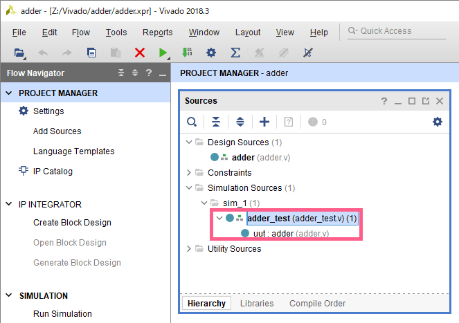
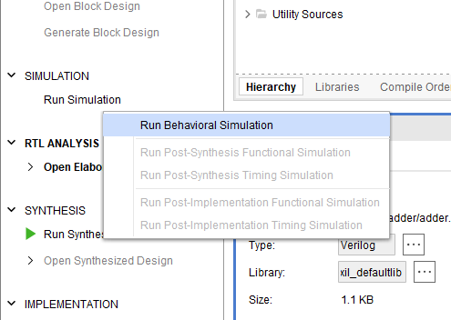
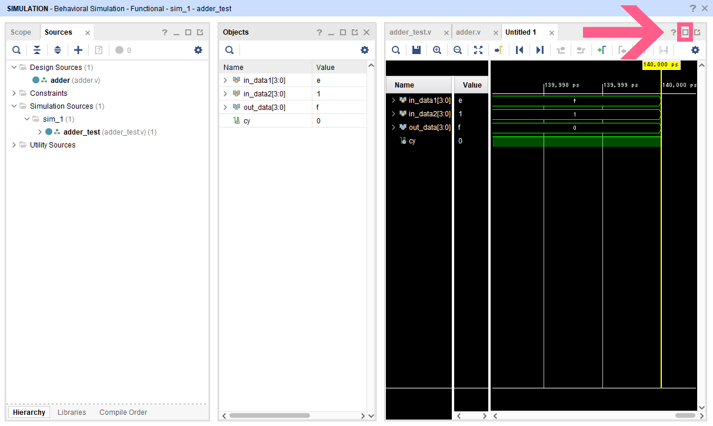
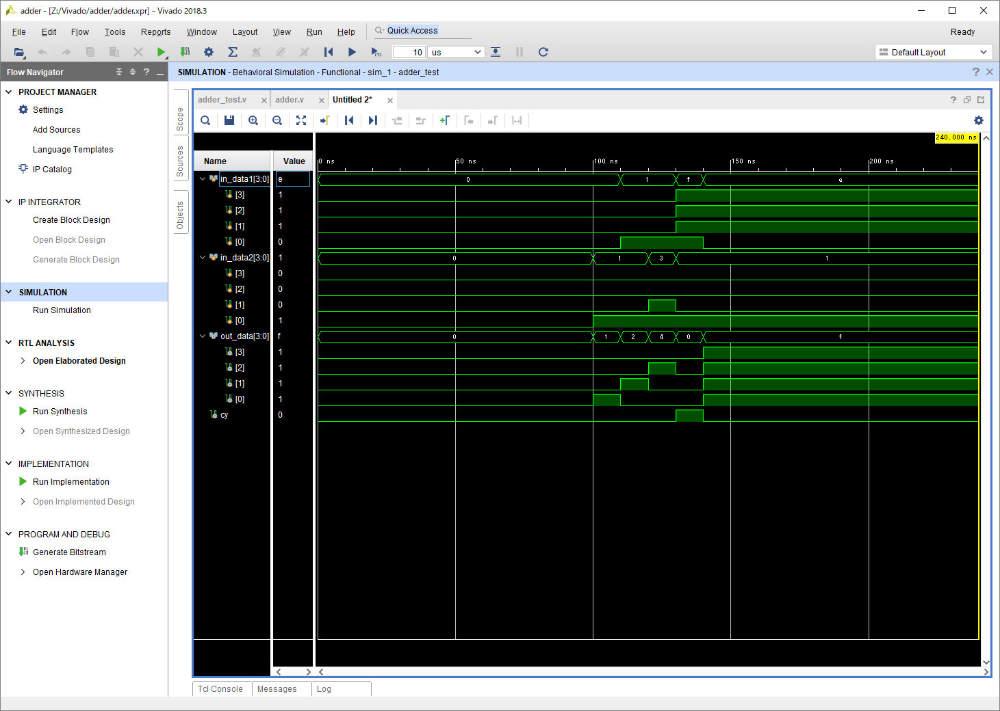

テストフィクスチャの作成が完了したら、以下の写真のように、テストフィクスチャと確認したい回路が入れ子のような状態で表記されているか確認する  
(入れ子のようになっていない場合、テストフィクスチャを右クリック => `Set as Top`  
 それでも入れ子にならない場合、テストフィクスチャの記述が間違っている可能性がある)

`Messages` パネルにエラーがないことを確認したら、  
`Flow Navigator` => `SIMULATION` => `Run Simulation` をクリックし、  
`Run Behavioral Simulation` をクリック

以下のように画面が変わったら、波形を最大化するために `□` ボタンをクリック

以下のように、波形ウインドウが大きく表示されていればOK  
波形の操作に関しては次のセクションを参照
