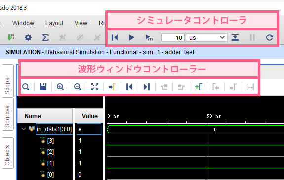
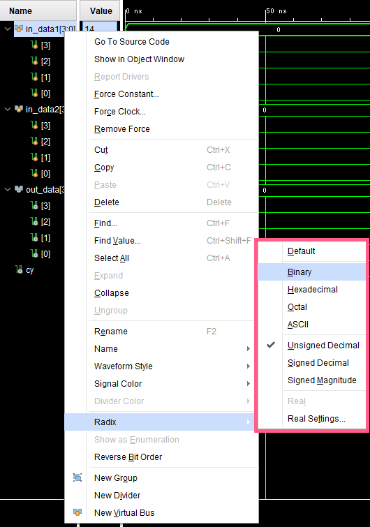

波形操作ウィンドウでは、`シミュレータコントローラ`と、`波形ウィンドウコントローラ`の2種類のコントローラを用いて、回路の出力結果の表示を操作することができます。  
それぞれ、代表的なボタンについてのみ説明します。

## シミュレータコントローラ
|ボタン|説明|
|:-:|:-|
||シミュレーションをリセットし、現在の波形を消去する|
||シミュレーションを実行する (`$finish`が現れたら、シミュレーションを停止する)|
||右側のボックスで指定した秒数分だけ、シミュレーションを実行する|
||シミュレーションを一時停止する (`$finish`を書かなかった時などに使用する)|
||ソースを読み込み直して、シミュレーションを実行する RTL記述やテストフィクスチャを修正した時は、このボタンを使うと良い|

## 波形ウィンドウコントローラ
|ボタン|説明|
|:-:|:-|
||波形の時間軸をを拡大する。より細かい部分の波形が見られるようになる|
||波形の時間軸を縮小する。より広い範囲の波形が見られるようになる|
||生成した波形全体を表示する 波形を生成した直後や、位置がわからなくなった際に使用すると良い。|
||画面をカーソルが中央になるようにに移動させる カーソルは黄色の線で表される|
||カーソルを波形の先頭 (時間=0) の位置に移動させる|
||カーソルを波形の終端の位置に移動させる|
||特定の波形を選択している時、 カーソルを前の立ち上がりエッジまたは立ち下がりエッジに移動させる|
||特定の波形を選択している時、 カーソルを次の立ち上がりエッジまたは立ち下がりエッジに移動させる|

## 波形部分の16進表記の変更
波形の `Value` の表示は、デフォルトで16進表記になっている。  
一方、加算などを実行した際などは、2進数や10進数で表示された方が見やすい。  

変更するには、表示を変えたい波形の `Name` の部分を右クリックし、  
`Radix` の中から好きな表示を選べばよい。

